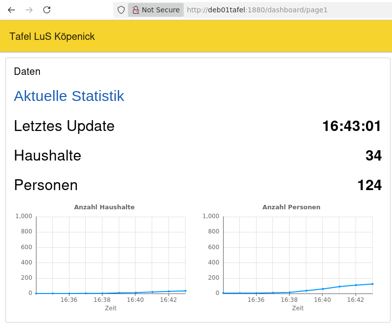
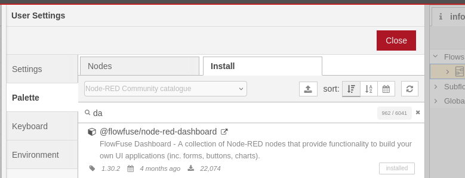
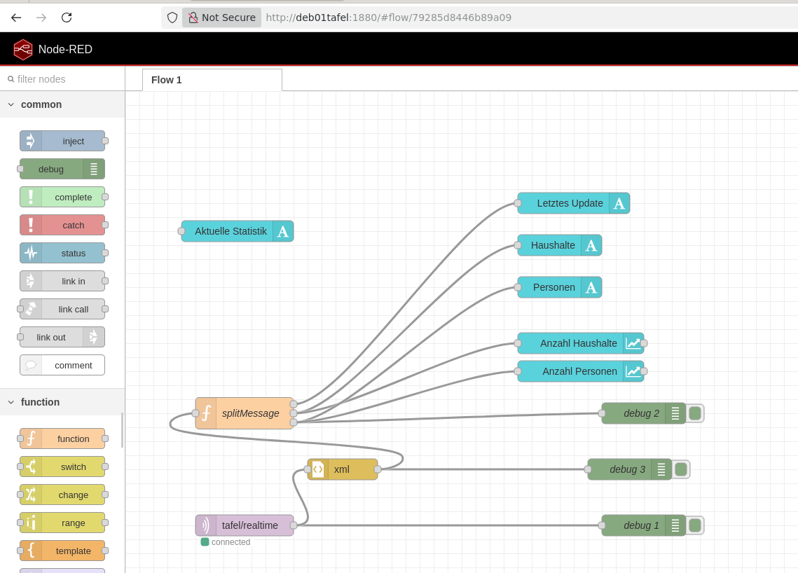

# Tafel MQTT Scripte 

zur "realtime" Anzeige der versorgten Haushalten und Personen

  

# zu installierende Softwarepakte

- mosquitto mosquitto-clients 
- Node-RED 

# benutzteSoftwarepakete

- mariadb client (installiert mit mariadb)
- cron (mit Debian installiert) 
- bash (mit Debian installiert)

# 

# Konfiguration der scripte

copy der Scripte tafel_realtime.sh, tafel_realtime.sql, tafel_realtime_test.sh to Tafel Kundenverwaltung
set execute bit für all .sh files


tafel_realtime.sh: Anpassung der Pfade und Einstellungen z.B.:

```
MOSQUITTO_HOST="localhost"
MOSQUITTO_PORT="1883"

```
```
TAFELPATH=$HOME"/Tafel Kundenverwaltung"
DATABASEINFO=$TAFELPATH"/DatabaseInfo.properties"
SQLFILE="tafel_realtime.sql"
#Broker
MOSQUITTO_USER="<mosquitto user>"
MOSQUITTO_PWD="<mosquitto_password>"
MOSQUITTO_HOST="<mosquitto_host>"
MOSQUITTO_PORT="<mosquitto_port>"

```

tafel_realtime_test.sh: Anpassung der Einstellungen:

```
#Broker
MOSQUITTO_USER="<mosquitto user>"
MOSQUITTO_PWD="<mosquitto_password>"
MOSQUITTO_HOST="<mosquitto_host>"
MOSQUITTO_PORT="<mosquitto_port>"

```
Aufnahme tafel_realtime.sh in cron job (z.B. jede Minute)

# Node-RED

- Öffne node red in browser (http://<noderedhost>:1880/
- Install @flowfuse/node-red-dashboard in Node-RED 


- import tafel_realtime_flow.json 


- configure mqtt in node


# Dashboard MQTT Scripts 

for “real-time” display of connected households and individuals


# Software packages to install

- mosquitto mosquitto-clients 
- Node-RED 

# Software packages used

- mariadb client (installed with mariadb)
- cron (installed with Debian) 
- bash (installed with Debian)

# 

# Configuration of the scripts

Copy the scripts tafel_realtime.sh, tafel_realtime.sql, tafel_realtime_test.sh to the Tafel Customer Management directory
Set the execute bit for all .sh files


tafel_realtime.sh: Adjust paths and settings, e.g.:

```
MOSQUITTO_HOST="localhost"
MOSQUITTO_PORT="1883"

```
```
TAFELPATH=$HOME“/Tafel Customer Management”
DATABASEINFO=$TAFELPATH“/DatabaseInfo.properties”
SQLFILE=“tafel_realtime.sql”
#Broker
MOSQUITTO_USER="<mosquitto user>"
MOSQUITTO_PWD="<mosquitto_password>"
MOSQUITTO_HOST="<mosquitto_host>"
MOSQUITTO_PORT="<mosquitto_port>"

```

tafel_realtime_test.sh: Adjusting the settings:

```
#Broker
MOSQUITTO_USER="<mosquitto user>"
MOSQUITTO_PWD="<mosquitto_password>"
MOSQUITTO_HOST="<mosquitto_host>"
MOSQUITTO_PORT="<mosquitto_port>"

```

Add the `tafel_realtime.sh` script to a cron job (e.g., every minute)

# Node-RED

- Open Node-RED in your browser (http://<noderedhost>:1880/
- Install @flowfuse/node-red-dashboard in Node-RED 


- Import tafel_realtime_flow.json 


- Configure MQTT in Node


Translated with DeepL.com (free version)