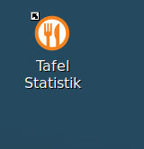

# Tafel Statistikscripte 

Die SQL Scripte erzeugen 3 CSV Dateien für die Weiterverarbeitung 
Das Zielverzeichnis muss auf dem Host sein wo die mariadb läuft
Im Script ist /data_export/tmp konfiguriert
Die Rechte müssen entsprechend gesetzt werden


Ausführung als superuser (root)

```
cd /
mkdir data_export/tmp
chown mysql data_export
chown mysql data_export/tmp
chmod 777 data_export
chmod 777 data_export/tmp
 
```


``` 
RIGHTS       OWNER GROUP
drwxrwxrwx 3 mysql root 4096 Jan  1 00:00 data_export 

drwxrwxrwx 2 mysql root 4096 Jan  1 00:00 tmp
```
 

# Dateien

- statistik.sh			bash script für Statistik Auswertung (erzeugt csv Dateien)
- KeyGen.sh				erzeugt die Key für openssl (BlowfishEncryption.java) (nur wenn in java source geändert wird ist das notwendig)
- statistik_template.sql	template für mysql mit Platzhaltern 
- install_statistik.sh	bash script für copy ins Tafelverzeichnis und Erzeugung .desktop Datei
- tafelstatistik.png		Icon

#Install
Öffnen Sie ein Terminal
Erzeugen Sie ein tmp Verzeichnis und wechseln in dieses Verzeichnis

``` 
user@host:~$ mkdir tmp
user@host:~$ cd tmp
user@host:~/tmp$
```
Kopieren Sie die Dateien statistik.sh, statistik_template.sql, install_statistik.sh,statistik.sh und tafelstatistik.png	ins tmp Verzeichnis
Im tmp Verzeichnis sind dann die folgenden Dateien:

```
user@host:~/tmp$ ls
install_statistik.sh  statistik.sh  statistik_template.sql  tafelstatistik.png
```

Machen sie install_statistik.sh ausführbar

```
user@host:~/tmp$ chmod +x install_statistik.sh 

```
und führen das Script aus

```
user@host:~/tmp$ ./install_statistik.sh 

```

Im  Tafelverzeichnis sind dann zusätzlich die Dateien
 
 - Statistik.desktop
 - statistik.sh              
 - tafelstatistik.png
 - statistik_template.sql  
 
vorhanden und auf dem Desktop ist ein Icon "Tafel Statistik" angelegt 



Das tmp Verzeichnis kann mit den Dateien  gelöscht werden 


```
user@host:~/tmp$ cd ~
user@host:~$ rm -r  tmp

```

# Statistics Scripts Table 

The SQL scripts generate 3 CSV files for further processing 
The destination directory must be on the host where MariaDB is running
The script is configured to use /data_export/tmp
The permissions must be set accordingly


Run as superuser (root)

```
cd /
mkdir data_export/tmp
chown mysql data_export
chown mysql data_export/tmp
chmod 777 data_export
chmod 777 data_export/tmp
 
```


``` 
RIGHTS       OWNER GROUP
drwxrwxrwx 3 mysql root 4096 Jan  1 00:00 data_export 

drwxrwxrwx 2 mysql root 4096 Jan  1 00:00 tmp
```
 

# Files

- statistik.sh            Bash script for statistical analysis (generates CSV files)
- KeyGen.sh               Generates the key for OpenSSL (BlowfishEncryption.java) (only necessary if changes are made to the Java source)
- statistik_template.sql  template for MySQL with placeholders 
- install_statistik.sh    Bash script for copying to the table directory and generating a .desktop file
- tafelstatistik.png      Icon

#Install
Open a terminal
Create a tmp directory and change to that directory

``` 
user@host:~$ mkdir tmp
user@host:~$ cd tmp
user@host:~/tmp$
```
Copy the files statistik.sh, statistik_template.sql, install_statistik.sh, statistik.sh, and tafelstatistik.png to the tmp directory
The following files will then be in the tmp directory:

```
user@host:~/tmp$ ls
install_statistik.sh  statistik.sh  statistik_template.sql  tafelstatistik.png
```

Make install_statistik.sh executable

```
user@host:~/tmp$ chmod +x install_statistik.sh

```

The Tafel directory will then also contain the following files:
 
 - Statistik.desktop
 - statistik.sh              
 - tafelstatistik.png
 - statistik_template.sql  
 
and an “Tafel Statistik” icon will be created on the desktop 


The tmp directory can be deleted along with its files


```
user@host:~/tmp$ cd ~
user@host:~$ rm -r tmp

```
